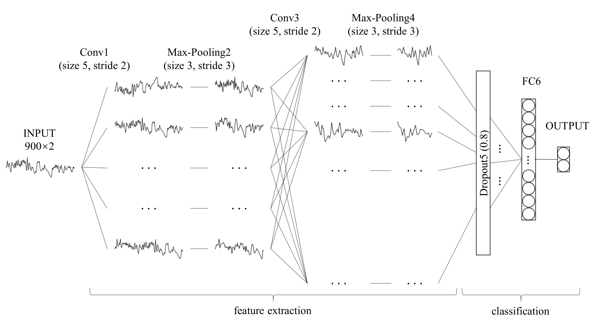

# Sleep Apnea Detection from a Single-Lead ECG

**In one sentence:** we look at a person's heartbeat recording while they sleep, cut it into one-minute pieces, and a small neural network says for each minute — *"apnea"* or *"normal"*.



---

## 1. Explain it like I'm five 🍼

**Sleep apnea** is when someone *stops breathing for a few seconds* while asleep, over and over, all night. It is dangerous (heart problems, strokes) and very common.

**The old way to find it:** you sleep overnight in a hospital, covered in ~20 wires and sensors, while a specialist watches you. That test is called *polysomnography (PSG)*. It is expensive, uncomfortable, and needs an expert.

**Our way:** just **one ECG wire** on the chest — the kind a smartwatch or a cheap patch can record.

Why does a heartbeat know about breathing? Because when you stop breathing, your body panics a little:

- your heart **speeds up and slows down** in a distinctive rhythm, and
- the **height of each heartbeat spike** on the ECG wobbles as your chest moves.

Those two clues are enough. A computer can learn them.

```
   😴 person sleeping
        │
        │  one sticky ECG electrode
        ▼
   ~∿~∿~∿~∿~  raw heart signal
        │
        ▼
   🤖 our neural network
        │
        ▼
   minute 1: normal ✅
   minute 2: normal ✅
   minute 3: APNEA  ⚠️
   minute 4: APNEA  ⚠️
   ...
```

**Why a neural network?** Older methods needed a human ECG expert to hand-pick "features" (heart-rate variability numbers, frequency bands, and so on). A **convolutional neural network (CNN)** invents its own features from raw data. No expert needed.

**The one extra trick in this project:** to judge minute *N*, we don't only look at minute *N*. We also show the network the **2 minutes before and the 2 minutes after** — a 5-minute window. Apnea events don't start and stop cleanly on a minute boundary, so the neighbours carry evidence. This is the "adjacent segments" idea, and it's what makes the accuracy jump.

---

## 2. The pipeline, step by step

### Step 1 — Get the data

We use the public **[Apnea-ECG database](https://physionet.org/content/apnea-ecg/1.0.0/)** from PhysioNet:

| | Recordings | What it is |
|---|---|---|
| **Training set** | 35 (`a01`–`a20`, `b01`–`b05`, `c01`–`c10`) | Whole nights of ECG, with a doctor's label for **every single minute**: `A` = apnea, `N` = normal |
| **Test set** | 35 (`x01`–`x35`) | The competition's held-out nights; answers live in [`dataset/event-2-answers`](dataset/event-2-answers) |

The ECG is sampled at **100 Hz** (100 numbers per second). One minute = 6,000 numbers. That's far too much raw data to feed a small network, so:

### Step 2 — Squeeze the ECG into two clean signals (`Preprocessing.py`)

For each 5-minute window, the script does this:

1. **Band-pass filter** (3–45 Hz) — throws away breathing drift and mains hum, keeps the sharp heartbeat spikes.
2. **Find the R-peaks** — the tall spikes, one per heartbeat (Hamilton segmenter from `biosppy`, then a correction pass).
3. **Sanity-check the window.** Fewer than 40 or more than 200 beats per minute? Impossible heart rate? **Throw the window away.** Garbage in, garbage out.
4. **Build two derived signals:**
   - **RRI** — *R-to-R Interval*: the gap in seconds between consecutive heartbeats. This is literally "how fast is the heart beating right now". Smoothed with a median filter to kill single-beat glitches.
   - **Amplitude** — the height of each R-peak. This wiggles with chest movement, i.e. with breathing effort.

```
raw ECG:   ─┴─╮─┴─╮──┴─╮─┴─╮───┴─╮   (spiky, 30,000 numbers per window)
              ↓ find peaks
R-peaks:    │   │    │   │     │
              ↓ measure
RRI:        0.81  0.94  0.78  1.02  seconds   ← "heart rhythm"
Amplitude:  1.12  0.98  1.20  0.91  mV        ← "breathing effort"
```

Everything is saved to `dataset/apnea-ecg-database-1.0.0/apnea-ecg.pkl`. **Run this once** — every later script just loads that pickle.

### Step 3 — Make every window the same size

Heartbeats are irregular, so different windows produce different numbers of RRI values — but a neural network demands a fixed-size input. Fix: **cubic-spline interpolation** onto a regular 3 Hz grid (`ir = 3`), plus min–max normalisation to the range 0–1.

Result — every sample is exactly the same shape:

```
5 minutes × 60 seconds × 3 samples/second = 900 time steps
                                          × 2 channels (RRI, Amplitude)
      →  input tensor of shape (900, 2)
```

### Step 4 — The network (`LeNet.py`)

A **modified LeNet-5**. The original LeNet-5 (LeCun, 1998) read handwritten digits in 2D; ours is the same idea in **1D**, walking along time instead of across an image.

```
input (900, 2)              two side-by-side signals
   │
Conv1D  32 filters, size 5, stride 2, ReLU     ← learn short heartbeat patterns
MaxPool 3                                       ← keep the strongest, shrink 3×
   │
Conv1D  64 filters, size 5, stride 2, ReLU     ← combine them into longer patterns
MaxPool 3                                       ← shrink again
   │
Dropout 0.8                                     ← randomly mute neurons; stops memorising
Flatten
Dense   32, ReLU
Dense   2, softmax                              → [P(normal), P(apnea)]
```

Plain-English version of each piece:

- **Conv1D** — a small sliding window (5 samples wide) that hunts for one specific shape in the signal. 32 filters = 32 different shapes learned at once. `stride 2` = it hops two steps at a time, which halves the length.
- **MaxPool** — "of these 3 neighbouring values, keep only the loudest". Makes the network shorter and less fussy about exact timing.
- **Dropout 0.8** — during training, silence most neurons at random. Sounds mad; it forces the network to spread its knowledge instead of memorising the training nights.
- **L2 regularisation** (`weight=1e-3`) — a gentle penalty on large weights. Same goal: generalise, don't memorise.
- **Softmax** — turns the last two numbers into probabilities that add up to 1.

Training: Adam optimiser, categorical cross-entropy loss, batch size 32, 20 epochs, with a learning-rate scheduler that decays ×0.1 late in training.

### Step 5 — Judge it honestly

The test nights (`x01`–`x35`) are **never** seen during training. We report:

- **Accuracy** — how many minutes were called right overall.
- **Sensitivity (recall)** — of the real apnea minutes, how many did we catch? *Missing a sick patient is the expensive mistake, so this one matters most.*
- **Specificity** — of the real normal minutes, how many did we correctly leave alone?
- **AUC-ROC** — one number for "how well does the model rank apnea above normal", regardless of where you put the cut-off.
- **Confusion matrix** — the 2×2 grid of right/wrong, both ways.

Per-minute scores are written to `output/LeNet.csv` (`y_true`, `y_score`, `subject`), and curves to `performance_curvesle.png`.

---

## 3. Results

Recomputed from the committed `output/LeNet.csv` (16,945 test minutes across all 35 test subjects, threshold 0.5):

| Metric | Score |
|---|---|
| Accuracy | **83.4 %** |
| Sensitivity (apnea caught) | **88.6 %** |
| Specificity (normal left alone) | **80.2 %** |

Read it as: out of every 100 real apnea minutes we flag about 89, and out of every 100 normal minutes we correctly ignore about 80. Comparable to classical machine-learning methods — but with **zero hand-engineered features**.

Training curves: `performance_curvesle.png` (LeNet), `performance_curvesGLN.png` (GoogLeNet), `performance_curveshyb.png` (hybrid).

---

## 4. The other models we tried

Same input, same data, different brains — so we could compare fairly.

| Script | Model | Idea in one line |
|---|---|---|
| `LeNet.py` | **Modified LeNet-5 (1D)** | The main model. Small, fast, the paper's method. |
| `Pre-training.py` | Classic LeNet-5 (2D) | The textbook 1998 architecture (Conv2D + average pooling, 120→84→2 dense) applied to the same data — a baseline to beat. |
| `GoogleLeNet.py` | **1D GoogLeNet / Inception** | Much deeper. Each *inception module* looks at the signal with 1-, 3-, and 5-wide filters **at the same time** and glues the results together, so it sees short and long patterns simultaneously. |
| `hybrid.py` | **1D GoogLeNet + LSTM** | Inception blocks extract features, then two **LSTM** layers (memory cells that read a sequence in order) model how those features evolve over time. Adds batch-norm, early stopping and checkpointing. |

**Why an LSTM?** A CNN sees patterns; an LSTM remembers *order*. Apnea comes in repeating cycles through the night, so memory can help.

---

## 5. What every file does

| File | What it's for |
|---|---|
| `Preprocessing.py` | **Run first.** Raw PhysioNet records → RRI + amplitude signals → `apnea-ecg.pkl`. Multiprocessed. |
| `LeNet.py` | Train + evaluate the modified LeNet-5. Saves `models/model.final.h5`, `output/LeNet.csv`, curves. |
| `Pre-training.py` | Classic LeNet-5 baseline → `models/custom_lenet5_model.h5`. |
| `GoogleLeNet.py` | Train + evaluate the 1D Inception model. |
| `hybrid.py` | Train + evaluate the Inception + LSTM model. |
| `app.py` | **Flask REST API.** `POST /predict` (one window → Apnea / Non-Apnea + probability), `POST /detect_points` (slides a 30-second window with a 10-second step over a long signal and returns exactly *when* apnea occurs), `GET /metrics` (accuracy, confusion matrix, ROC curve as a base64 PNG). CORS enabled for a web front-end. |
| `patientdata.py` | Whole-patient report: counts apnea episodes, computes the **AHI (Apnea–Hypopnea Index = events per hour of sleep)** and prints a positive/negative verdict. |
| `Report.py` | Generates the figures used in the write-up (signals, feature maps, confusion matrix, ROC). |
| `extract.py` | Dumps the pickled dataset back out to CSV for inspection in Excel. |
| `analyse.py` | Scratchpad for dataset statistics over `output/sleep_data.csv` (per-record minutes, AI/HI/AHI, age, sex, height, weight). Most of it is commented-out experiments. |
| `models/`, `*.h5` | Saved trained weights. |
| `output/LeNet.csv` | Per-minute test predictions. |
| `output/sleep_data.csv` | Per-recording ground-truth summary (35 records with AHI + demographics). |
| `evaluation_results.csv` | Per-sample true label, predicted label and probability. |
| `utils/` | The official per-recording scoring code from the PhysioNet challenge. |

**Jargon decoder:** *AI* = apnea index, *HI* = hypopnea index, *AHI* = the two added together, per hour. AHI ≥ 5 is mild, ≥ 15 moderate, ≥ 30 severe.

---

## 6. Running it yourself

### Install

```bash
pip install numpy scipy scikit-learn pandas matplotlib seaborn \
            tensorflow keras wfdb biosppy tqdm netron flask flask-cors
```

### ⚠️ First, fix the paths

Every script has a hard-coded Windows path near the top:

```python
base_dir = r"D:\finalyearproject\...\dataset\apnea-ecg-database-1.0.0"
```

Change it to wherever this repo lives on *your* machine, or the scripts will not find the data. (On Linux/macOS: `base_dir = "dataset/apnea-ecg-database-1.0.0"`.)

### Then

```bash
# 1. Download the Apnea-ECG records into dataset/apnea-ecg-database-1.0.0/
#    from https://physionet.org/content/apnea-ecg/1.0.0/

# 2. Build the processed dataset (do this once; it takes a while)
python Preprocessing.py

# 3. Train and evaluate the main model
python LeNet.py

# 4. Or try the alternatives
python GoogleLeNet.py
python hybrid.py

# 5. Serve predictions over HTTP
python app.py          # http://127.0.0.1:5000
```

Example API call:

```bash
curl -X POST http://127.0.0.1:5000/predict \
  -H "Content-Type: application/json" \
  -d '{"rri_tm":[...],"rri_signal":[...],"ampl_tm":[...],"ampl_signal":[...]}'
# → {"prediction": "Apnea", "apnea_probability": 0.87}
```

Each list needs **at least 4 points** — cubic spline interpolation cannot work with fewer.

### Version note

Keras and TensorFlow change their optimisers between releases, and both have inherent randomness, so your numbers will wobble a little. The original paper used **Keras 2.3.1 / TensorFlow 1.15.0**; the scripts here run on the TF 2.x `tensorflow.keras` API.

---

## 7. Honest limitations

- Trained on **35 nights** from one 1990s database — small, and not diverse in age, ethnicity, or recording hardware.
- Labels are **per minute**, so the model cannot pinpoint a 20-second event on its own; `app.py`'s `/detect_points` approximates this by sliding a shorter window, but the model was never trained at that resolution.
- Windows with noisy or implausible heart rates are **discarded**, not classified. A real device would have to decide what to do with them.
- **This is a research project, not a medical device.** It does not diagnose anyone. Real diagnosis needs a clinician.

---

## 8. Credit

Method and dataset preparation follow:

> Wang T, Lu C, Shen G, et al. *Sleep apnea detection from a single-lead ECG signal with automatic feature-extraction through a modified LeNet-5 convolutional neural network.* **PeerJ**, 2019, 7: e7731. https://doi.org/10.7717/peerj.7731

Dataset: [Apnea-ECG Database](https://physionet.org/content/apnea-ecg/1.0.0/), PhysioNet.

Licensed under the terms in [LICENSE](LICENSE).
